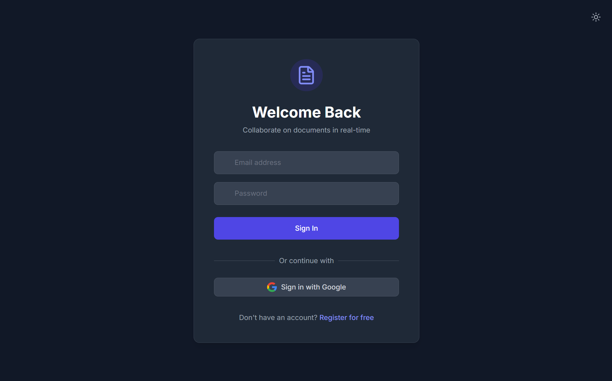
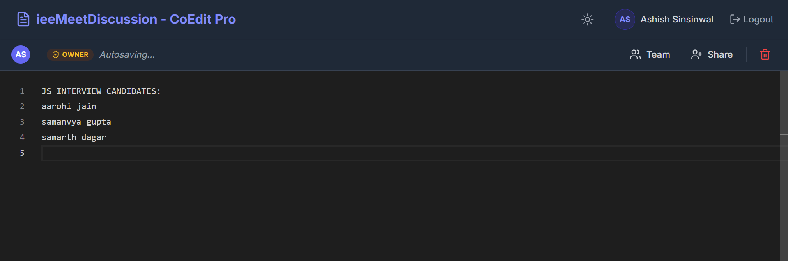
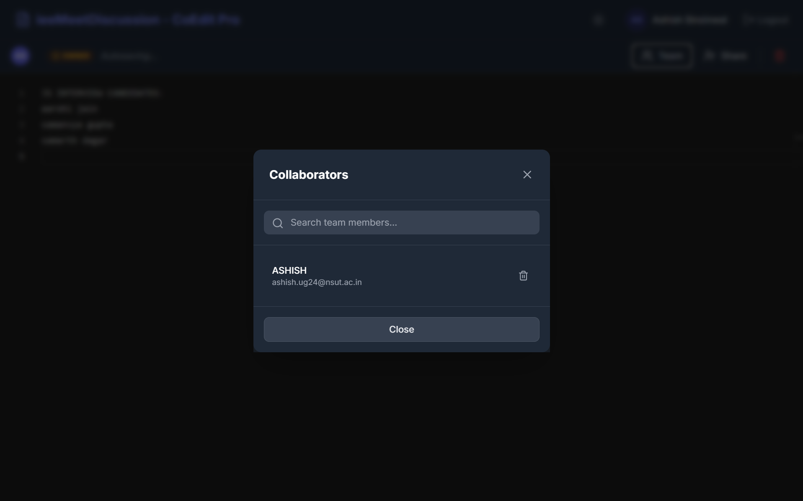

# CoEdit 📝

**Real-Time Collaborative Document Editor**

CoEdit is a real-time collaborative document editor where multiple users can edit the same document simultaneously. It focuses on system design, real-time synchronization, and scalability, rather than rich text features.

Think Google Docs — but simplified and engineered for learning real-time systems.

---

## 📸 Screenshots


**Landing Page**  


**Dashboard – Your Documents**  


**Editor – Real-Time Collaboration**  


**Multiple Users Editing**  


---

## 🚀 Features

* ✏️ Real-time collaborative editing
* 🔐 Authentication (Email/Password + Google OAuth)
* 📄 Create and manage documents
* 👥 Add collaborators by email
* 💾 Server-authoritative auto-save
* ⚡ Low-latency updates using Redis + Socket.io

---

## 🧠 How It Works

```
User types
   ↓
Client sends update to server
   ↓
Server validates & orders updates
   ↓
Redis stores latest document state
   ↓
Redis Pub/Sub broadcasts update
   ↓
All connected clients sync instantly
```

**Why this design?**
* Server is the single source of truth
* Simple & deterministic conflict handling (last-write-wins)
* Scales across multiple backend instances
* Easy to reason about and debug

---

## 🏗️ Architecture

```
Frontend (React + Monaco Editor)
    ↓
Socket.io (WebSocket)
    ↓
Backend (Node.js + Express)
    ↓
Redis (Live Document State)
MongoDB (Users, Docs, Permissions)
```

**Why Redis + MongoDB?**
* Redis → fast, in-memory, real-time document state + Pub/Sub
* MongoDB → persistent storage for users, documents, collaborators

---

## 🛠️ Tech Stack

### Frontend
* React (Vite)
* Monaco Editor
* Socket.io Client

### Backend
* Node.js
* Express
* Socket.io

### Databases
* MongoDB (Users, Documents, Collaborators)
* Redis (Live document state + Pub/Sub)

### Auth
* JWT
* Google OAuth

---

## ⚙️ Local Setup

### Prerequisites
* Node.js
* Docker
* MongoDB

### 1️⃣ Start Redis (Local)

```bash
docker run -p 6379:6379 redis
```

### 2️⃣ Backend Setup

```bash
cd backend
npm install
```

Create `backend/.env`:

```env
PORT=5000
MONGO_URI=mongodb://localhost:27017/coedit
REDIS_URL=redis://localhost:6379
JWT_SECRET=your-secret
GOOGLE_CLIENT_ID=your-google-client-id
GOOGLE_CLIENT_SECRET=your-google-secret
FRONTEND_URL=http://localhost:5173
```

Run backend:

```bash
npm run dev
```

### 3️⃣ Frontend Setup

```bash
cd frontend
npm install
```

Create `frontend/.env`:

```env
VITE_BACKEND_URL=http://localhost:5000
VITE_GOOGLE_CLIENT_ID=your-google-client-id
```

Run frontend:

```bash
npm run dev
```

---

## 📡 API Endpoints

### Auth

```
POST /auth/register
POST /auth/login
POST /auth/google
```

### Documents

```
POST /documents
GET  /documents
POST /documents/:documentId/collaborators
GET /documents/:documentId/collaborators
DELETE /documents/:documentId/collaborators/:email
DELETE /documents/:id

```

Protected routes require:

```
Authorization: Bearer <JWT>
```

---

## 🔌 Socket Events

### Client → Server
* `document:join` `{ docId }`
* `document:update` `{ docId, content }`

### Server → Client
* `document:init` `{ docId, content }`
* `document:remoteUpdate` `{ docId, content }`
* `document:error` `"Access denied"`

---

## ⚠️ Known Limitations (MVP by design)

* Full document sync (no CRDT / OT)
* Concurrent edits on same line → last write wins
* No cursor presence
* No version history

---

## 🚧 Future Improvements

* CRDT / OT-based conflict resolution
* Cursor presence & user indicators
* Version history & rollback
* Rich text formatting
* Comments & suggestions