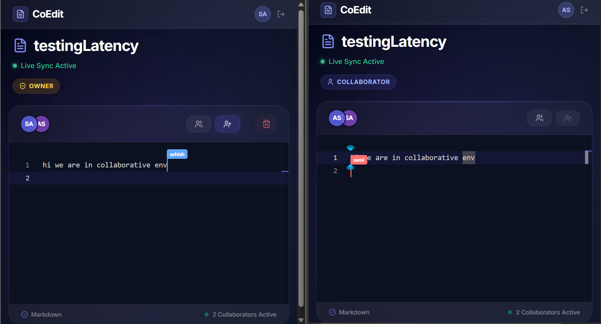

# CoEdit 📝

> **A server-authoritative, real-time collaborative document editor.**

CoEdit is a lightweight, real-time collaborative text editor allowing multiple users to edit the same document simultaneously. Engineered to demonstrate distributed systems concepts, CoEdit prioritizes low-latency synchronization, scalable state management, and clean system architecture over complex rich-text formatting.

Think Google Docs—simplified and built for real-time performance.

---

## 📸 Sneak Peek

### Landing Page


### Dashboard


### Editor


### Live Cursor Tracking



---

## 🚀 Key Features

### ⚡ Real-Time Collaboration

Low-latency document synchronization across multiple active clients.

### 🟢 Live User Presence

Real-time tracking of active collaborators currently viewing and editing a document.

### 🎯 Live Cursor Tracking

See collaborator cursors move in real time with user labels and cursor indicators, enabling a more natural collaborative editing experience similar to Google Docs and Figma.

### 🔐 Secure Authentication

JWT-based email/password login alongside Google OAuth integration.

### 👥 Access Control

Invite specific collaborators via email to view and edit personal documents.

### 💾 Server-Authoritative State

Deterministic last-write-wins conflict handling backed by Redis caching and real-time synchronization.

---

## 🧠 System Architecture

CoEdit utilizes a hybrid database approach to balance persistent storage with lightning-fast transient state synchronization.

```text
[ React Client ]
      │
      ├── WebSocket Updates
      ├── Presence Updates
      └── Cursor Position Updates
               │
               ▼
      [ Node.js Server ]
               │
      ├── Redis Pub/Sub
      │      ├── Document Updates
      │      ├── Presence Events
      │      └── Cursor Events
      │
      ├── Redis Cache
      │      └── Live Document State
      │
      └── MongoDB
             ├── Users
             ├── Documents
             └── Permissions
```

### Design Decisions

#### Centralized Source of Truth

The Node.js server remains authoritative over document state and collaboration events, simplifying synchronization and conflict resolution.

#### Redis for Speed

Redis handles rapid document updates, presence broadcasts, and cursor synchronization with extremely low latency.

#### MongoDB for Persistence

Stores users, documents, collaborator permissions, and document metadata.

---

## 🛠️ Tech Stack

### Frontend

* React (Vite)
* Tailwind CSS
* Monaco Editor
* Socket.io-client

### Backend

* Node.js
* Express.js
* Socket.io

### Databases

* MongoDB (Mongoose)
* Redis

### Authentication

* JWT
* Google OAuth

---

## 🔌 Real-Time Collaboration Features

### Document Synchronization

* Real-time content updates
* Automatic state propagation
* Low-latency collaborative editing

### Presence Awareness

* Active collaborator tracking
* Owner/collaborator role visibility
* Live participant count

### Cursor Awareness

* Real-time cursor broadcasting
* User-labelled cursors
* Multi-user cursor rendering
* Automatic cleanup on disconnect

---

## 📡 Socket Integration

### Client Emissions

```javascript
document:join { docId }
```

Join a document room and fetch initial state.

```javascript
document:update { docId, content, telemetry }
```

Broadcast content changes.

```javascript
document:cursorMove { docId, position, user }
```

Broadcast cursor position updates.

```javascript
document:leave { docId }
```

Leave a document room.

---

### Server Broadcasts

```javascript
document:init { docId, content }
```

Return cached document state.

```javascript
document:remoteUpdate { docId, content, telemetry }
```

Synchronize content updates.

```javascript
document:active_presence { docId, activeMembers }
```

Broadcast active users.

```javascript
document:cursorUpdate { docId, cursors }
```

Broadcast live collaborator cursor positions.

```javascript
document:error { message }
```

Handle access and authorization errors.

---

## 🚧 Roadmap & Future Enhancements

### Collaboration

* CRDT-based synchronization
* Operational Transformation (OT)
* Collaborative selections
* Inline comments and suggestions

### Productivity

* Version history
* Document snapshots
* Rollback support

### Editor Enhancements

* Rich text editing
* Slash commands
* AI-assisted writing

### Platform Features

* Notifications
* Teams & organizations
* Shared workspaces
* Offline support

---

## ⭐ Why CoEdit?

CoEdit demonstrates how modern collaborative systems can be built using:

* WebSockets
* Redis Pub/Sub
* Distributed state synchronization
* Presence tracking
* Live cursor awareness
* Server-authoritative architecture

while maintaining low latency and a clean user experience.
