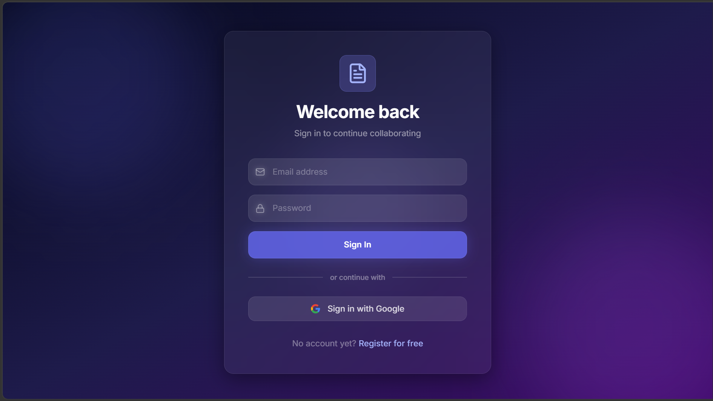
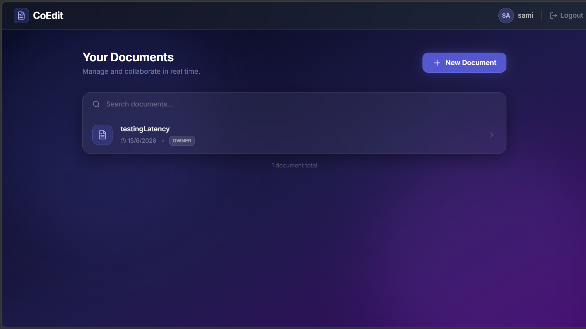
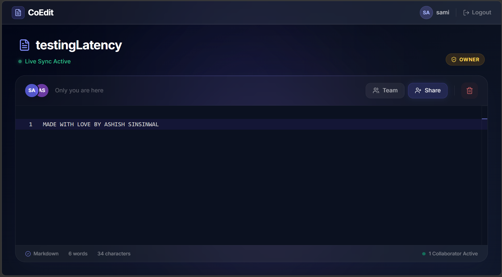
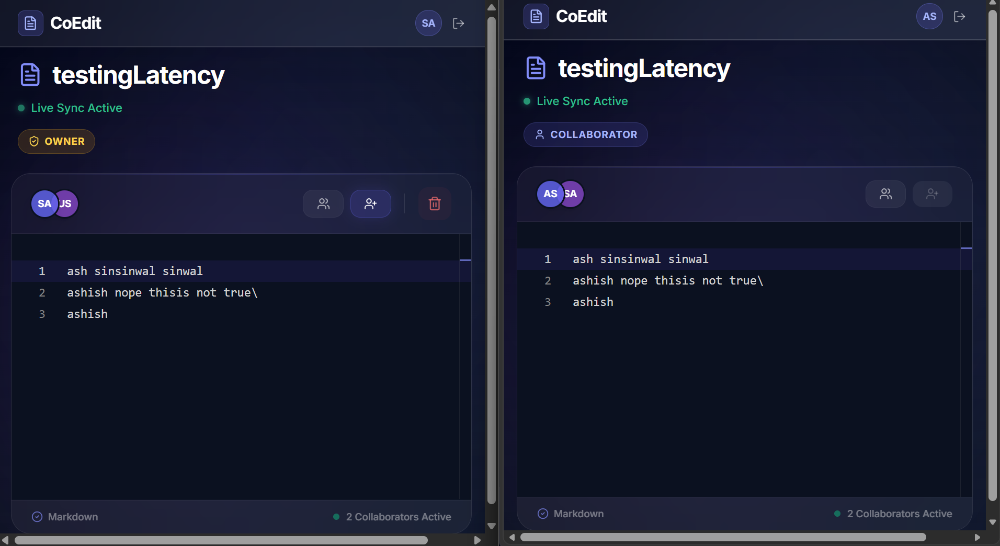
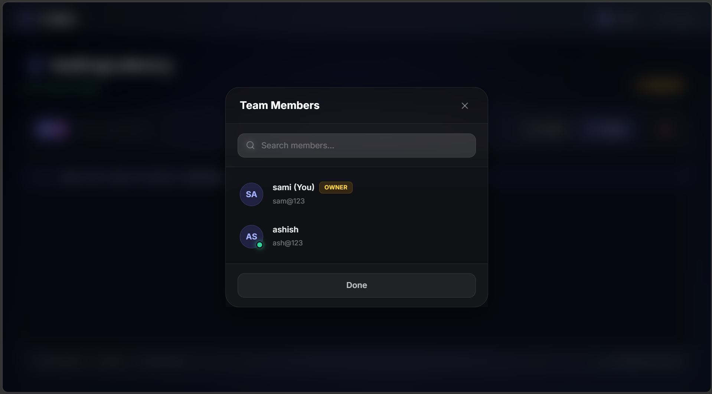

# CoEdit 📝

> **A server-authoritative, real-time collaborative document editor.**

CoEdit is a lightweight, real-time collaborative text editor allowing multiple users to edit the same document simultaneously. Engineered to demonstrate distributed systems concepts, CoEdit prioritizes low-latency synchronization, scalable state management, and clean system architecture over complex rich-text formatting.

Think Google Docs—simplified and built for real-time performance.

---

## 📸 Sneak Peek

### Landing Page


### Dashboard


### Real-Time Editor


### Real-Time collab


### multiUser


---

## 🚀 Key Features

* ⚡ **Real-Time Collaboration:** Low-latency document synchronization across multiple active clients.
* 🟢 **Live User Presence:** Dynamic tracking of active collaborators and document owners in the current session.
* 🔐 **Secure Authentication:** JWT-based email/password login alongside Google OAuth integration.
* 👥 **Access Control:** Invite specific collaborators via email to view and edit personal documents.
* 💾 **Server-Authoritative State:** Deterministic, last-write-wins conflict handling backed by an auto-saving Redis cache.

---

## 🧠 System Architecture

CoEdit utilizes a hybrid database approach to balance persistent storage with lightning-fast transient state synchronization.

```text
[ React Client ] <--(WebSockets)--> [ Node.js Server ]
                                          |
                                          ├--> [ Redis Pub/Sub ] --> (Broadcasts to other clients)
                                          |
                                          ├--> [ Redis Cache ] (Stores live document state)
                                          |
                                          └--> [ MongoDB ] (Persistent storage for Users, Docs, Roles)
```

### Design Decisions

#### Centralized Source of Truth

The Node.js server maintains authority over the document state, simplifying conflict resolution.

#### Redis for Speed

In-memory caching handles the high-throughput, rapid-fire keystroke updates, while Pub/Sub effortlessly scales message broadcasting across connected sockets.

#### MongoDB for Persistence

Relies on document-based storage for long-term user profiles, access control lists, and overarching document metadata.

---

## 🛠️ Tech Stack

### Frontend

* React (Vite)
* Tailwind CSS
* Monaco Editor
* Socket.io-client

### Backend

* Node.js
* Express.js
* Socket.io

### Databases

* MongoDB (Mongoose)
* Redis

### Authentication

* JWT
* Google Auth Library

---

## ⚙️ Local Development Setup

### Prerequisites

* Node.js (v18+)
* Docker (for local Redis)
* MongoDB instance (local or Atlas)

---

### 1. Initialize Redis

```bash
docker run -p 6379:6379 -d redis
```

---

### 2. Backend Setup

```bash
cd backend
npm install
```

Create a `.env` file inside the backend directory:

```env
PORT=5000
MONGO_URI=mongodb://localhost:27017/coedit
REDIS_URL=redis://localhost:6379
JWT_SECRET=your_super_secret_key
GOOGLE_CLIENT_ID=your_google_client_id
GOOGLE_CLIENT_SECRET=your_google_client_secret
FRONTEND_URL=http://localhost:5173
```

Start the backend:

```bash
npm run dev
```

---

### 3. Frontend Setup

```bash
cd frontend
npm install
```

Create a `.env` file inside the frontend directory:

```env
VITE_BACKEND_URL=http://localhost:5000
VITE_GOOGLE_CLIENT_ID=your_google_client_id
```

Start the frontend:

```bash
npm run dev
```

---

## 📡 API Reference

### Authentication

| Method | Endpoint         | Description                     |
| ------ | ---------------- | ------------------------------- |
| POST   | `/auth/register` | Create a new account            |
| POST   | `/auth/login`    | Authenticate via email/password |
| POST   | `/auth/google`   | Authenticate via Google OAuth   |
| GET    | `/auth/me`       | Retrieve current user profile   |

### Documents

| Method | Endpoint                              | Description                            |
| ------ | ------------------------------------- | -------------------------------------- |
| GET    | `/documents`                          | List user's owned and shared documents |
| POST   | `/documents`                          | Create a new document                  |
| DELETE | `/documents/:id`                      | Delete a document                      |
| GET    | `/documents/:id/collaborators`        | List authorized users                  |
| POST   | `/documents/:id/collaborators`        | Grant access to a user                 |
| DELETE | `/documents/:id/collaborators/:email` | Revoke access                          |

> **Note:** All protected routes require:
>
> ```http
> Authorization: Bearer <token>
> ```

---

## 🔌 Socket Integration

### Client Emissions

```javascript
document:join { docId }
```

Subscribes to a document room and fetches initial state.

```javascript
document:update { docId, content, telemetry }
```

Pushes a local keystroke update.

```javascript
document:leave { docId }
```

Unsubscribes from the room and updates presence.

---

### Server Broadcasts

```javascript
document:init { docId, content }
```

Returns the cached Redis state.

```javascript
document:remoteUpdate { docId, content, telemetry }
```

Syncs incoming changes from peers.

```javascript
document:active_presence { docId, activeMembers }
```

Broadcasts a real-time array of online users.

```javascript
document:error { message }
```

Handles unauthorized access attempts.

---

## 🚧 Roadmap & Future Enhancements

While CoEdit currently relies on a highly performant **Last-Write-Wins** model for MVP simplicity, future iterations will explore:

* CRDTs (Conflict-free Replicated Data Types)
* Operational Transformation (OT)
* Live Cursor Tracking
* Version History
* Document Snapshots & Rollbacks
* Rich Text Support
* Inline Comments & Suggestions
* Presence Indicators
* Offline Editing Support

---

## 🤝 Contributing

Contributions, suggestions, and feedback are always welcome.

1. Fork the repository
2. Create a feature branch

```bash
git checkout -b feature/amazing-feature
```

3. Commit your changes

```bash
git commit -m "Add amazing feature"
```

4. Push to GitHub

```bash
git push origin feature/amazing-feature
```

5. Open a Pull Request

---

## 📄 License

This project is licensed under the MIT License.

---

## ⭐ Support

If you found this project useful, consider giving it a star on GitHub.

It helps the project grow and motivates future development.
